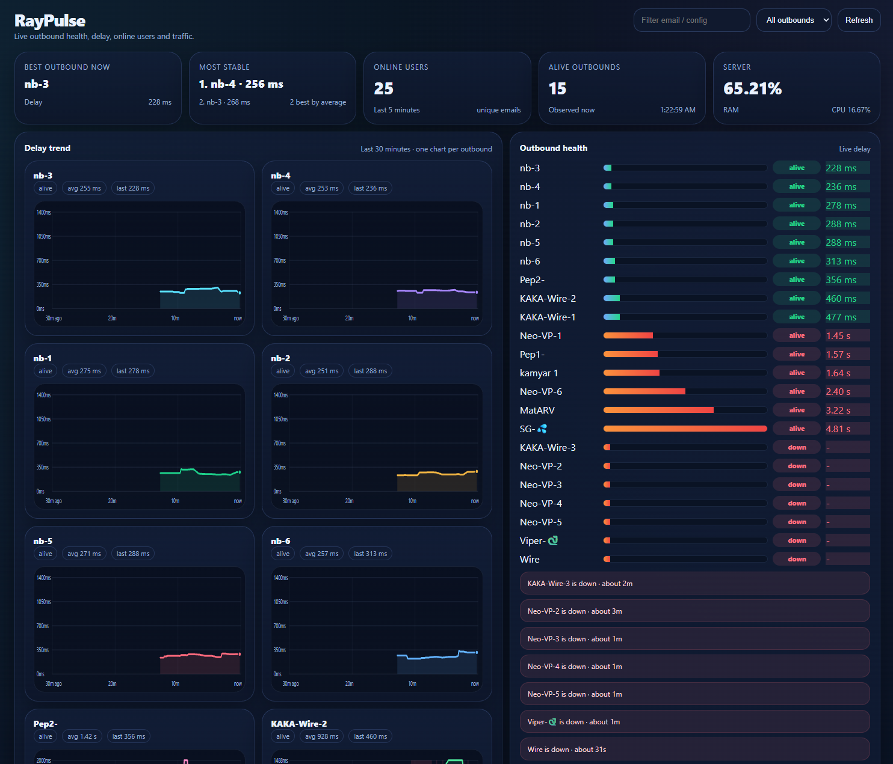

# RayPulse

RayPulse یک پنل سبک و ساده برای مانیتورینگ اوت‌باندهای Xray است.

این پنل می‌تواند این موارد را نمایش دهد:

- تاخیر و وضعیت اوت‌باندها
- بهترین اوت‌باند در لحظه
- پایدارترین اوت‌باندها
- کاربران آنلاین بر اساس لاگ
- مصرف ترافیک اوت‌باندها در صورتی که از `debug/vars` در دسترس باشد

## قابلیت‌ها

- برنامه تک‌فایل پایتون
- نصب به‌صورت سرویس systemd
- امکان استفاده از HTTPS با سرتیفیکیت خودتان
- نصب تعاملی
- نمایش کاربران آنلاین بر اساس access log
- نمودار تاخیر 30 دقیقه اخیر
- جدول ترافیک اوت‌باندها
- نمایش زنده وضعیت سلامت اوت‌باندها

## تصویر پنل

<details>
<summary>برای دیدن اسکرین‌شات کلیک کنید</summary>



</details>

## نصب سریع

```bash
bash <(curl -Ls https://raw.githubusercontent.com/Matialz7/RayPulse/main/install.sh)
```

## نصب از فایل ZIP

1. فایل ZIP پروژه را دانلود کنید
2. روی سرور extract کنید
3. این دستورات را اجرا کنید:

```bash
chmod +x install.sh
./install.sh
```

## نصب‌کننده چه چیزهایی می‌پرسد؟

اسکریپت نصب این موارد را از شما می‌پرسد:

- آدرس Metrics URL
- مسیر Access Log
- آدرس Bind Host
- شماره پورت
- حالت TLS
- مسیر فایل گواهی TLS
- مسیر فایل کلید TLS

## مسیرهای پیش‌فرض

- Metrics URL: `http://127.0.0.1:11112/debug/vars`
- Access log: `/usr/local/x-ui/access.log`

## مدیریت سرویس

```bash
systemctl status RayPulse
systemctl restart RayPulse
systemctl stop RayPulse
journalctl -u RayPulse -f
```

## حذف پنل

```bash
chmod +x uninstall.sh
./uninstall.sh
```

## نکات مهم

- قبل از استفاده از پورت `443` مطمئن شوید که خالی باشد.
- اگر دامنه را پشت CDN گذاشته‌اید، باید Origin و TLS به‌درستی تنظیم شده باشند.
- نمایش ترافیک اوت‌باندها فقط وقتی کار می‌کند که Xray آمار لازم را در `debug/vars` ارائه دهد.

## لایسنس

MIT
